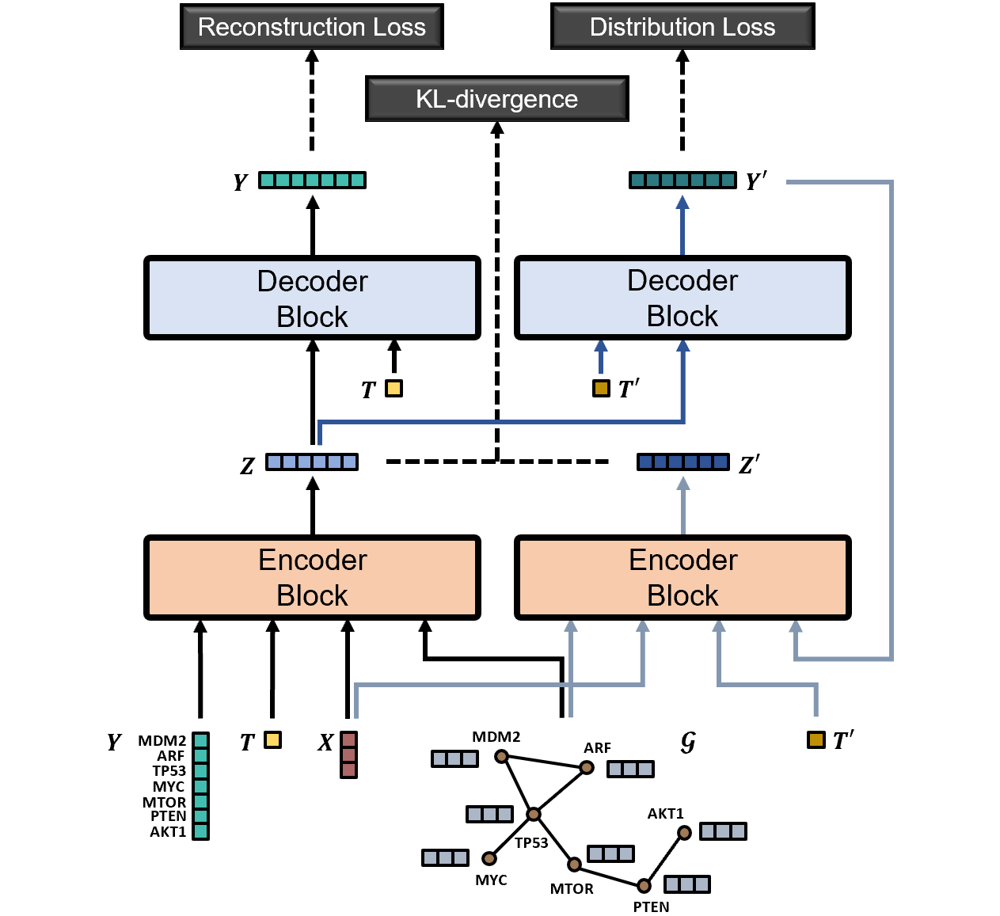
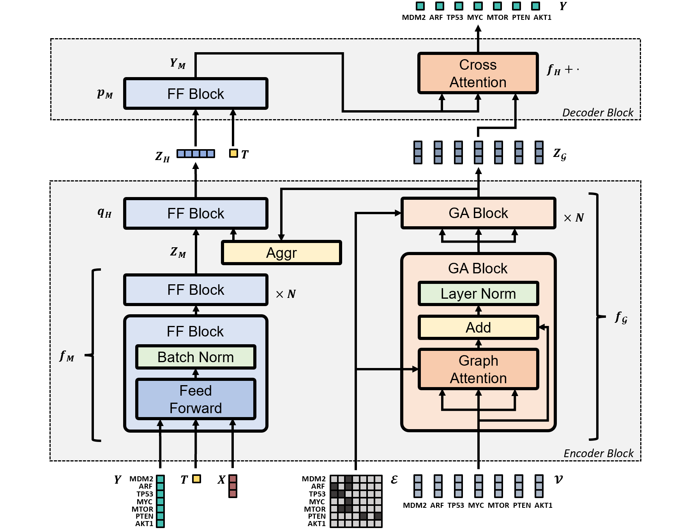

# Graph Variational Causal Inference

This repository is the official implementation of [**Predicting Cellular Responses with Variational Causal Inference and Refined Relational Information**](https://arxiv.org/abs/2210.00116).

### Workflow
<p align="center">
  
</p>

### Architecture
<p align="center">
  
</p>

### Dataset
The L008 CROP-seq dataset released with our paper can be found [here](https://osf.io/a87cu/).


## Installation

### 1. Create Conda Environment
```bash
conda config --append channels conda-forge
conda create -n gvci-env --file requirements.txt
conda activate gvci-env
```

### 2. Install Learning Libraries
- [Pytorch](https://pytorch.org/) [**1.13**.1](https://pytorch.org/get-started/previous-versions/)
- [Pytorch Geometric](https://pytorch-geometric.readthedocs.io/en/latest/) [**2.3**.1](https://pytorch-geometric.readthedocs.io/en/2.3.1/install/installation.html)

  \* *make sure to install the right versions for your toolkit*

### 3. Install Submodule
```bash
git submodule update --init --recursive
pip install -e variational-causal-inference
```


## Run

Visit our [resource site](https://osf.io/5n2mz/), download the contents of `main/datasets` into [datasets](datasets) and the contents of `main/graphs` into [graphs](graphs). To process your own dataset, see `data-prep` branch; to generate your own graph, see `graph-prep` branch. If using gene relational graphs is not desired, see the [repository](https://github.com/yulun-rayn/variational-causal-inference) for [**Variational Causal Inference**](https://arxiv.org/abs/2209.05935).


Once the environment is set up and the contents are prepared, the function call to train & evaluate graphVCI is:

```bash
./main.sh &
```

A list of flags may be found in `main.sh` and `main.py` for experimentation with different hyperparameters. The run log and models are saved under `*artifact_path*/saves`, and the tensorboard log is saved under `*artifact_path*/runs`.

## License

Contributions are welcome! All content here is licensed under the MIT license.

